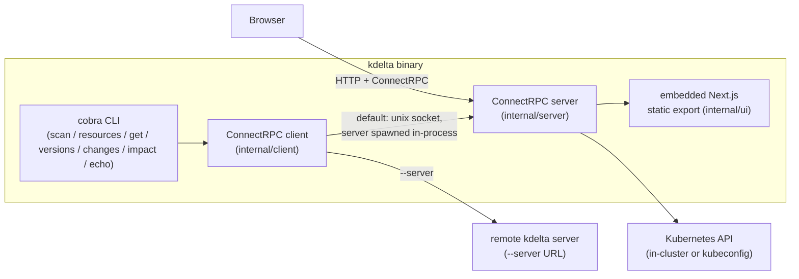
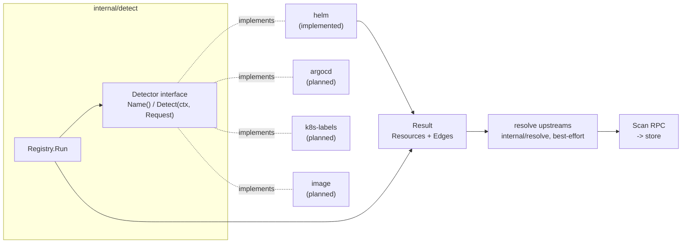
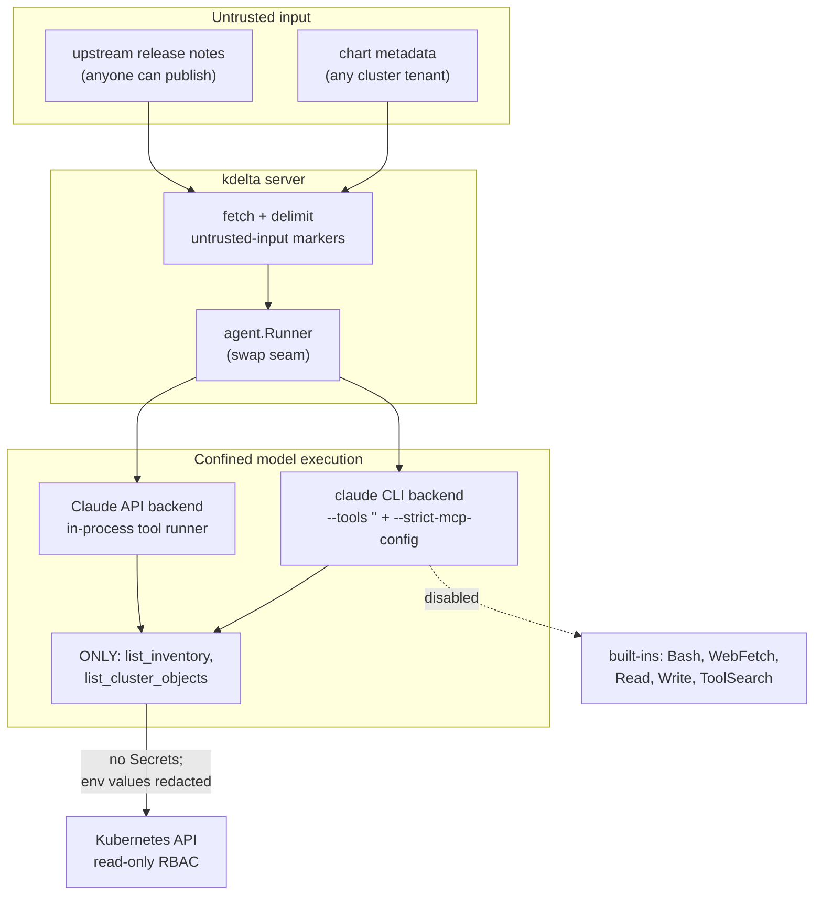
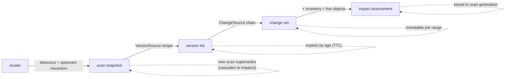

# Architecture

kdelta detects what is deployed in a Kubernetes cluster, resolves the versions of
those resources, fetches the changelogs between the deployed and target versions,
and assesses the impact of upgrading on the rest of the system.

This document describes the architecture as built. The `scan → versions →
changes → impact` pipeline runs end to end; where a component is planned rather
than implemented it is marked as such inline. Unbuilt work is tracked in
[ROADMAP.md](ROADMAP.md).

## Contents

- [One binary, client/server inside](#one-binary-clientserver-inside)
- [Protobuf-first contracts](#protobuf-first-contracts)
- [Domain model](#domain-model)
- [Detectors](#detectors)
- [AI boundaries](#ai-boundaries)
  - [Agent tool confinement](#agent-tool-confinement)
- [Storage & the community dataset](#storage--the-community-dataset)
- [Frontend](#frontend)
- [Deployment](#deployment)
  - [Cluster access model](#cluster-access-model)
- [Supply chain](#supply-chain)

## One binary, client/server inside

kdelta ships as a single Go binary that is both the CLI and the server.

- **Every command goes through the ConnectRPC client.** There is no separate
  "local" code path: without `--server`, the CLI spawns the server in-process and
  connects over a unix domain socket; with `--server <url>` it talks to a remote
  instance. This keeps local and remote behavior identical.
- **`kdelta serve`** is the only command that starts a long-lived server. It
  binds a TCP address (`--bind`), serves the ConnectRPC API, and serves the
  embedded web UI from the same mux.
- The ConnectRPC API is mounted under the `/rpc/` prefix; everything else falls
  through to the embedded static UI.
- gRPC health (`grpc.health.v1.Health`) and server reflection are mounted at
  the root — raw gRPC clients (kubelet's native gRPC probes, `grpcurl`,
  `buf curl`) cannot traverse path prefixes. The kustomize deployment probes
  readiness and liveness through the health service.

## Protobuf-first contracts

All data models and services are defined in protobuf (`proto/`) with
[protovalidate](https://buf.build/bufbuild/protovalidate) constraints, and code
is generated with buf:

- **Go** (messages + Connect handlers/clients) into `gen/`.
- **TypeScript** (protobuf-es) into `packages/api/`, the package the web UI
  consumes.

Generated code is committed; CI verifies `task generate` produces no diff. The
same contracts will back the MCP surface (via `modelcontextprotocol/go-sdk`) so
agents get the identical API the UI uses.

The full surface is `Scan`, `ListResources`, `GetResource`, `ListVersions`,
`GetChanges`, and `AssessImpact`, and all of it is implemented. `Echo` is a
liveness placeholder (see the roadmap for its retirement). `Unimplemented` is
returned only for version sources that have no resolver yet (git tags, OCI
registries, container tags).

## Domain model

The domain model is designed; [design/DATA_MODEL.md](design/DATA_MODEL.md)
carries the full rationale. The essentials:

- **Two identity layers**: `ResourceRef` (`detector:namespace/name`) names a
  detected thing in a cluster; `PackageKey` (`system`, `name`, `registry_url`)
  names the upstream project globally — versions and changelogs attach to the
  latter, which is what makes them cacheable and dataset-exportable.
- **Version streams**: a resource has independently-updatable streams (chart,
  app, each image), each with its current value, a desired-state constraint,
  an ordering scheme, a `VersionSource` recipe, and an ordered `ChangeSource`
  fallback chain. Recipes are data, not code.
- **Normalized changes**: whatever the source, extraction lands in
  `ChangeSet → Change` with `affected_paths` (the impact join key) and
  `Provenance` (verbatim vs. AI-derived is a schema field, not a footnote).
- **Hierarchy**: ownership-semantics edges between resources
  (`OWNS`/`DEPENDS_ON`/`PART_OF`), mirroring how the cluster expresses
  ownership.

## Detectors

`scan` runs a registry of detectors (`internal/detect`), each responsible for
one signal:

| Detector | Signal | Status |
| --- | --- | --- |
| helm | Release storage (secrets) via the Helm Go SDK: chart + app versions | Implemented |
| argocd | `Application` resources: revisions, sources, sync state | Planned |
| k8s-labels | `app.kubernetes.io/*` labels on workloads | Planned |
| image | Image tags/digests, OCI `org.opencontainers.image.*` annotations | Planned |

Detectors emit resources, versions, hierarchy edges, and upstream links. New
resource types are supported by registering a new detector — see
[design/DETECTORS.md](design/DETECTORS.md) for the implementation path.

A detector reports `detect.ErrNotApplicable` when it cannot run against the
target cluster for an expected reason (its CRD is absent, or the connection
lacks access to the resource it reads). The registry skips it and continues;
every other error fails the scan, because a silently partial inventory would
skew impact analysis downstream.

Detectors are built on the official SDKs — client-go/apimachinery for cluster
access, the Helm Go SDK for release storage — but the SDKs stop at the
detector boundary: the protobuf contracts never import Kubernetes generated
protos. Our messages borrow k8s API *conventions* instead (GVK + object
references, ownerReference-style hierarchy edges, label maps, conditions,
label-selector scan filters) and detectors map SDK types into them.

Detectors stay pure cluster reads; what the cluster does not record is filled
in afterwards. An installed Helm release keeps its chart metadata but not the
repository it came from, so between the detectors and the cache `Scan` runs an
**upstream resolution** step (`internal/resolve`): it searches Artifact Hub for
candidate repositories, verifies each candidate's `index.yaml` entry at the
deployed chart version against the release's own metadata (appVersion,
home/source URLs), and on a verified match fills `PackageKey.registry_url` and
the chart stream's `HelmRepositorySource` with `FETCHED` source provenance.
The deployed metadata is the primary matcher (so forks resolve to their real
repository, not the famous one) and Artifact Hub's official/verified flags
only break ties. Resolution is deterministic HTTP — no AI — and best-effort:
outcomes are cached in the store (successes for a week, failures for a day),
and any failure leaves the resource exactly as detected. Residual risks
accepted: a tenant who copies a real chart's metadata verbatim gets their
release attributed to the real repository (the fetched data is then the
legitimate repository's — the harm is operator confusion about a workload that
tenant already controls); a repository that mirrors a real index byte-for-byte
can win resolution either as the sole verified match when the real repository
is absent from Artifact Hub's exact-name results, or — when both are listed —
only by strictly leading the official/verified/production-use trust ordering; and a
resolved-but-hostile repository controls only its own version list
(size-capped, typed-parsed, no free text reaches prompts). When in doubt at
any step, the resolver leaves the package unresolved — the pre-resolution
behavior.

Every fetch this step (and every other upstream fetcher) performs passes the
egress guard in `upstream.Client`: https only, no userinfo, and the resolved
destination IP checked at dial time against loopback, link-local (including
the cloud metadata service), RFC1918/ULA, and CGNAT ranges — so a hostile
candidate URL is a blocked dial, not a request. Fetch targets come only from
Artifact Hub's listing; a cluster tenant can influence which listed
repositories are considered but can never name a fetch target.

## AI boundaries

| Command | AI usage |
| --- | --- |
| `scan` | none — detector reads plus deterministic upstream resolution (Artifact Hub) |
| `versions` | none — deterministic version-source resolvers only |
| `changes` | sources are fetched verbatim, then structured by the model into the normalized change model (provenance-labeled); without credentials the verbatim notes are served instead |
| `impact` | required — an agent loop cross-references the change set against live cluster state through a confined tool surface only (built-in tools disabled; the scan inventory and a no-secrets cluster lister mirroring the RBAC allowlist minus Secrets — see Agent tool confinement) |

Model-driven flows run behind the `agent.Runner` interface (`internal/agent`)
— the seam where execution backends swap without touching the RPC layer. Two
backends exist; a sandboxed one is on the roadmap:

- **Claude Agent SDK harness** (default when the `claude` CLI is on PATH):
  drives `claude -p` as a subprocess — the documented Agent SDK path for
  hosts without a native library — with kdelta's restricted tools served
  back to it over MCP by the hidden `kdelta agent-tools` command. This
  backend can bill the operator's **Claude subscription**: locally via the
  machine's `/login` credential, in servers/CI via `CLAUDE_CODE_OAUTH_TOKEN`
  (minted with `claude setup-token`; the demo overlay carries it as a
  sops-encrypted secret). An exported `ANTHROPIC_API_KEY` outranks the
  subscription in the CLI's credential precedence.
- **Claude API SDK** (fallback, or `KDELTA_AGENT=api`): direct Messages API
  + tool-runner loop; requires `ANTHROPIC_API_KEY`; model overridable via
  `ANTHROPIC_MODEL`.

`KDELTA_AGENT=claude|api` forces the choice. The container image ships the
`claude` CLI alongside the kdelta binary for the default backend.

### Agent tool confinement

Release-note bodies and the change set derived from them are **untrusted**:
anyone who can publish an upstream release (or plant a Helm chart whose
metadata points at their repo) controls text that flows verbatim into the
model prompts. The agent is confined so an injected instruction has nothing to
act with:

- **Built-in tools are disabled.** Both `claude` invocations pass `--tools ""`,
  which removes the entire built-in set (Bash, Read, Write, WebFetch,
  WebSearch, ToolSearch). `--permission-mode dontAsk` and `--allowedTools`
  govern *prompting*, not availability — `--tools` is what actually gates the
  built-ins. Extraction runs with no tools at all; impact additionally loads
  only the two kdelta MCP tools and passes `--strict-mcp-config` so no
  host-level MCP server can be injected.
- **The MCP cluster tools never expose secrets.** `list_cluster_objects` is
  bound to an allowlist that excludes the Secret resource entirely, trims every
  object to metadata/spec/status, and redacts literal container env values
  (which operators sometimes inline as credentials); `list_inventory` withholds
  Secret object refs so injected text cannot even learn secret names. This holds for both backends
  (the API backend's tool-runner is in-process; the CLI backend's tools are
  served over MCP).
- **Prompts label untrusted input.** Both system prompts instruct the model to
  treat release notes / the change set as data, never instructions, and the
  user turns wrap that content in explicit `<untrusted_…>` delimiters.

Residual risk is bounded by the cluster access model below (read-only RBAC)
and tracked on the roadmap (per-caller auth and a spend ceiling; an egress
NetworkPolicy; the sandboxed agent backend).

## Storage & the community dataset

Each stage reads the previous stage's cached output, so an impact assessment
does not re-scan the cluster, re-resolve versions, or re-extract changelogs:

Invalidation follows the pipeline: a change set is immutable for a given
`(package, kind, from, to)` range, version lists expire by age, and impact
assessments belong to the scan generation that produced them.

- `internal/store` is the local cache (SQLite via a pure-Go driver; Postgres
  swap on the roadmap): serialized protobuf payloads with indexed key columns
  for scan snapshots, version lists, change sets, and impact assessments — so
  determining impact does not re-scan, re-resolve versions, or re-extract
  changes every time. Default path: the per-user cache dir (`--db` overrides;
  `task clean` wipes it).
- Invalidation follows the pipeline: a new scan supersedes the previous one
  (resources and impact assessments belong to a scan and cascade away with
  it); version lists and upstream resolutions expire by age (failed
  resolution attempts sooner); change sets persist until regenerated — change
  data is cluster-independent.
- Much of the data (upstream links, version lists, changelogs) is universal, not
  cluster-specific. Instead of a centralized API service, that data lives in this
  repo (a planned `data/` directory) in a contribution-friendly layout, seeded
  with top CNCF projects. A planned `kdelta export` packages local cache into a
  contribution. Both are roadmap items; neither ships today.

## Frontend

A pnpm + Turborepo monorepo:

- `apps/app-ui` — the served UI. Next.js static export, embedded into the Go binary
  at build time. Talks to the API with `@connectrpc/connect-web` and the
  generated `packages/api` client. Views: Resources (scan) and Resource detail
  (from/to version dropdowns, changelog + impact actions).
- `apps/docs-ui` — the project's documentation and landing site, also a
  static export, deployed to GitHub Pages at kdelta.dev.
- `packages/api` — generated TypeScript client.
- `packages/theme` — Tailwind v4 CSS-first design tokens (shadcn-compatible
  variables), imported by both apps.
- `packages/ui` — shared shadcn/ui components (button, card, table, tabs,
  sidebar, and friends), used by both apps.

In dev, the Next dev server proxies `/rpc/*` to the Go server so there is no CORS
and the same relative URLs work in dev and when embedded.

## Deployment

- Multi-stage Dockerfile on Chainguard images (node → go → wolfi-base — the
  runtime is glibc wolfi-base because it ships the claude CLI; the kdelta
  binary itself stays static), versioned
  by Go's built-in VCS stamping.
- `infra/kustomize` deploys the server; the reusable `cloudflared` component +
  demo overlay expose `demo.kdelta.dev` through a Cloudflare tunnel, gated by
  Cloudflare Access at the edge, with the token sops-encrypted (PGP, ksops dotenv secrets under `secrets/<class>/`).
- skaffold + kind for the local cluster loop.

### Cluster access model

Outside a cluster, kdelta uses the operator's kubeconfig context — their
permissions apply. Deployed in-cluster, it runs as its own ServiceAccount with
**no permissions by default**; each overlay grants a curated read-only role
for exactly what its cluster needs. One deliberate sensitivity: Helm stores
releases as Secrets and RBAC cannot filter secrets by type, so helm detection
requires cluster-wide secret reads — the detector must parse only helm-typed
secrets and never expose other secret data through the API (hardening options
are tracked on the roadmap).

## Supply chain

Taskfile targets are the single implementation of build/lint/test — CI's verify
pipeline calls the same targets contributors run locally. Release publishing
uses the well-known actions for docker building, SBOMs, and signing (with
`task docker:build` / `task sbom` / `task sign` as the local equivalents).
Releases are cut by release-please with a repository-scoped GitHub App token
(so a published release triggers the publish workflow automatically); images
go to GitHub Packages with syft SBOMs, cosign signatures, and build
provenance attestations. A rendered k8s manifest ships as a release artifact.
