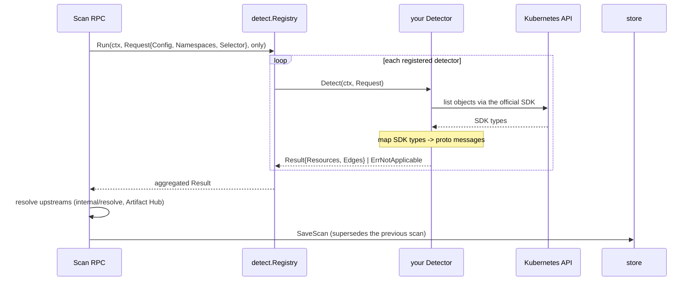
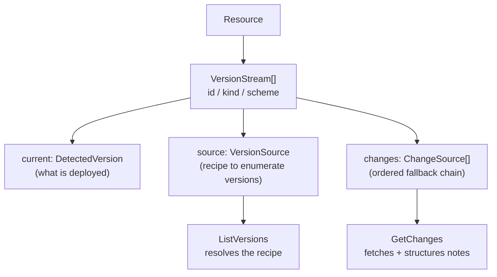

# Adding a detector

A detector is the unit that turns one cluster signal into kdelta's domain
model. Everything downstream — version resolution, changelog extraction,
impact assessment, the CLI, the UI — consumes the detector's output through
the same contracts, so a new detector inherits the whole pipeline without
touching it.

This guide is the implementation path, using the Helm detector
(`internal/detect/helm`) as the worked example.

## Contents

- [Where a detector fits](#where-a-detector-fits)
- [1. Implement the interface](#1-implement-the-interface)
- [2. Signal applicability, not failure](#2-signal-applicability-not-failure)
- [3. Emit the domain model](#3-emit-the-domain-model)
- [4. Wire version and change sources](#4-wire-version-and-change-sources)
- [5. Register the detector](#5-register-the-detector)
- [6. Test it behaviorally](#6-test-it-behaviorally)
- [Security obligations](#security-obligations)

## Where a detector fits

`Scan` runs the registry; each detector maps SDK types onto protobuf messages
and returns them. The registry aggregates the results into one inventory,
which the store caches and the later stages read.



The boundary matters: the SDKs stop at the detector. Kubernetes and Helm types
live inside your package; the protobuf contracts never import generated
Kubernetes protos. Your job is the translation.

## 1. Implement the interface

`internal/detect` defines the whole contract:

```go
type Detector interface {
    // Name is the ref's detector segment and the value a scan's
    // --detector filter matches ("helm").
    Name() string
    Detect(ctx context.Context, req Request) (Result, error)
}
```

`Request` carries the cluster connection (`Config *rest.Config`), the
`Namespaces` to scan (empty means every namespace the connection allows), and
a label `Selector`. `Result` carries `Resources` and hierarchy `Edges`.

Build clients from `req.Config` rather than reading a kubeconfig yourself, and
keep a constructor that accepts a pre-built client so tests can inject a fake:

```go
func New() *Detector { return &Detector{} }
func NewWithClient(client kubernetes.Interface) *Detector { ... }
```

Honor `req.Namespaces` and `req.Selector`, and pass `ctx` into every SDK call.

## 2. Signal applicability, not failure

A detector that cannot run for an expected reason — its CRD is not installed,
or the connection lacks RBAC for the resource it reads — returns
`detect.ErrNotApplicable`. The registry skips it and continues the scan.

```go
if apierrors.IsNotFound(err) || meta.IsNoMatchError(err) {
    return detect.Result{}, fmt.Errorf("argocd Applications unavailable: %w", detect.ErrNotApplicable)
}
```

Reserve it for applicability. Every other error is fatal to the scan by
design: a silently partial inventory would understate impact downstream, which
is worse than a failed scan.

## 3. Emit the domain model

Map onto the conventions the rest of the pipeline expects.

**Resource identity.** `ResourceRef` is `detector:namespace/name`; the
detector segment must equal `Name()`. Set `Upstream` (`PackageKey`) to the
globally-identifying upstream project — this is the key versions and
changelogs attach to, and what makes them cacheable and shareable across
clusters.

**Backing objects.** List the cluster objects the resource is derived from as
`KubernetesObjectRef` (`apiVersion`, `kind`, `namespace`, `name`). These
surface in `kdelta get` and give impact analysis concrete objects to name.

**Conditions.** Translate the source's health/state into `Condition` entries
using Kubernetes condition semantics (`Type`, `Status`, `Reason`).

**Provenance.** Everything a detector observes directly is
`PROVENANCE_METHOD_OBSERVED` with `Detector` set to your name. Provenance is a
schema field, not a footnote: it is what lets a reader tell observed facts
from AI-derived ones.

**Hierarchy edges.** When your signal expresses ownership, emit
`ResourceEdge` (`OWNS` / `DEPENDS_ON` / `PART_OF`) so the graph reflects how
the cluster actually relates things.

## 4. Wire version and change sources

A resource has one or more independently-updatable **version streams**. Helm
emits two: `chart` and `app`.



Each stream needs an `Id`, a `Kind`, an ordering `Scheme`, and a `Current`
value. A stream **without** a resolved `Source` is still valid and useful —
kdelta reports the deployed version — but `ListVersions` returns
`FailedPrecondition` for it, naming the streams that can be resolved. Leave
`Source` unset when the cluster does not record the upstream and let the
scan's resolution step (`internal/resolve`) fill it after detection, so
detectors stay pure cluster reads. Helm's `chart` stream is the worked
example: an installed release does not record the chart repository URL, so
the detector emits the stream sourceless and resolution finds and verifies
the repository via Artifact Hub. When resolution cannot verify a repository,
the stream simply stays sourceless.

Set `Source` when you can identify the upstream. Recipes are data, not code:

```go
app.Source = &kdeltav1.VersionSource{
    Source: &kdeltav1.VersionSource_GithubReleases{
        GithubReleases: &kdeltav1.GitHubReleasesSource{Owner: owner, Repo: repo},
    },
}
app.Changes = []*kdeltav1.ChangeSource{{
    Source: &kdeltav1.ChangeSource_ReleaseNotes{
        ReleaseNotes: &kdeltav1.ReleaseNotesSource{RepositoryUrl: ".../" + owner + "/" + repo},
    },
}}
```

A `Changes` chain does not require a version source: the Helm detector
attaches the same release-notes chain to the sourceless `chart` stream,
because the chart's notes live in the repository its metadata names. Streams
that set a `Source` also stamp `SourceProvenance` (`OBSERVED` for a detector;
the resolution step stamps `FETCHED`).

Resolvers implemented today are GitHub releases and Helm repository indexes.
If your detector needs a source with no resolver (git tags, OCI registries,
container tags), add a case to `fetchVersions` in `internal/server/versions.go`
and a fetcher in `internal/upstream` routed through `Client.get`, which is the
single HTTP chokepoint where the egress guard attaches. This step changes
once the roadmap's source-resolver registry lands and dispatch moves behind
its own seam. Upstream *identity* resolution (finding where a package is
published, as opposed to executing a known source recipe) is a different
seam: it lives in `internal/resolve` and runs inside `Scan`.

## 5. Register the detector

One line in `internal/client/client.go`:

```go
func Detectors() *detect.Registry {
    return detect.NewRegistry(helmdetect.New(), argocddetect.New())
}
```

That is the whole wiring. `Scan`, `--detector` filtering, the cache, the CLI,
and the UI pick it up with no further changes. If the detector reads a
resource type the deployed ServiceAccount cannot see, extend the overlay's
role in `infra/kustomize/overlays/` and note the sensitivity.

## 6. Test it behaviorally

Follow `internal/detect/helm/helm_test.go`: seed a fake clientset with objects
stored exactly as the real system stores them, run `Detect`, and assert on the
emitted domain model — refs, streams, sources, conditions, backing objects —
rather than on internal helpers. Cover the applicability path
(`ErrNotApplicable`) and namespace scoping.

Run `task test`; the pre-commit gate is `task precommit`.

## Security obligations

Detector input is untrusted. Anything a cluster tenant can write — chart
metadata, annotations, labels, image references — reaches kdelta's output and,
through changelogs, the model prompt.

- **Filter URLs before emitting them.** Every link must pass an http(s) scheme
  check (`isSafeHTTPURL` in the Helm detector) so a `javascript:` or `data:`
  URL can never reach a rendered `href` or a terminal hyperlink. Filter at the
  detector so the CLI is protected too, not only the web UI.
- **Do not emit secret payloads.** Reading a Secret to detect a release (as
  Helm requires) is acceptable; copying its contents into a `Resource` is not.
  Secret-kind object refs are withheld from the agent inventory.
- **Treat identifiers as data.** Names, labels, and annotations are rendered
  and fed to the model; never interpret them as instructions or paths.

See [ARCHITECTURE.md](../ARCHITECTURE.md) for the agent tool confinement and
cluster access models these obligations feed into.
